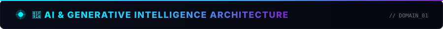
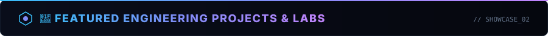

<!-- HERO BANNER -->
<div align="center">
  
</div>

<br />

<!-- TYPING ANIMATION & SUBTITLE -->
<div align="center">
  <a href="https://git.io/typing-svg">
    
  </a>
</div>

<div align="center">
  
  
  
</div>

<br />

<!-- QUICK NAVIGATION / SOCIAL BUTTONS -->
<div align="center">
  <a href="https://github.com/Tejas-952007">
    
  </a>
  &nbsp;
  <a href="https://www.linkedin.com/in/tejas-ingle-b4323b32a">
    
  </a>
  &nbsp;
  <a href="https://leetcode.com/u/Tejas-952007/">
    
  </a>
  &nbsp;
  <a href="https://github.com/Tejas-952007/Portfolio">
    
  </a>
  &nbsp;
  <a href="mailto:tejasingle952@gmail.com">
    
  </a>
</div>

<br />

---

<!-- DEVELOPER IDENTITY CODE CARD -->
### 🧑‍💻 Developer Profile Kernel

```python
class TejasIngle:
    def __init__(self):
        self.name = "Tejas Ingle"
        self.role = "AI & Data Science Engineer"
        self.university = "Savitribai Phule Pune University (SPPU)"
        self.college = "Nutan Maharashtra Institute of Engineering & Technology"
        self.year = "3rd Year B.E."
        
    @property
    def core_domains(self):
        return [
            "Artificial Intelligence",
            "Machine Learning",
            "Generative AI & RAG Architectures",
            "Agentic AI Systems",
            "Full-Stack Web Development",
            "Data Structures & Algorithms"
        ]

    @property
    def active_hackathon_project(self):
        return {
            "name": "ArogyaAI",
            "event": "MIT-ADT AI Grand Challenge 2026",
            "role": "Lead Architect & AI Developer",
            "tech_stack": ["FastAPI", "React", "Supabase", "Claude API", "XGBoost"]
        }

    def philosophy(self):
        return "Learn concepts → Build systems → Experiment & Break → Optimize & Ship"
```

<br />

---

<!-- TECH STACK SECTION -->
<div align="center">
  
</div>

<br />

#### 🧠 Generative & Agentic AI Stack
<p align="left">
  
  
  
  
  
  
  
  
  
</p>

#### 📊 Machine Learning & Data Science
<p align="left">
  
  
  
  
  
  
  
  
</p>

#### 🌐 Full-Stack & Engineering
<p align="left">
  
  
  
  
  
  
  
  
  
  
</p>

#### 💾 Databases & DevOps Tools
<p align="left">
  
  
  
  
  
  
  
  
</p>

<br />

---

<!-- FEATURED PROJECTS SECTION -->
<div align="center">
  
</div>

<br />

<table width="100%">
  <tr>
    <td width="50%" valign="top">
      <h3 align="left">🏥 Hospital Management System (HMS)</h3>
      <p align="left"><strong>Enterprise Healthcare Platform with State-Machine Scheduling</strong></p>
      <p align="left">Production-hardened healthcare backend and UI with strict appointment lifecycle management, doctor schedule conflict prevention, and MySQL transaction guarantees.</p>
      <p align="left">
        <code>React</code> • <code>Node.js</code> • <code>Express</code> • <code>MySQL</code> • <code>Tailwind</code>
      </p>
      <p align="left">
        <a href="https://github.com/Tejas-952007/Hospital-Management-System">
          
        </a>
        
      </p>
    </td>
    <td width="50%" valign="top">
      <h3 align="left">📈 BitPredict Pro</h3>
      <p align="left"><strong>Bitcoin Price Forecasting &amp; LSTM Neural Backtester</strong></p>
      <p align="left">Interactive crypto intelligence engine providing candlestick charts, multi-model ML classifiers (XGBoost, SVM, RF), and an LSTM deep learning engine with backtesting.</p>
      <p align="left">
        <code>Python</code> • <code>Streamlit</code> • <code>Scikit-Learn</code> • <code>LSTM</code> • <code>XGBoost</code>
      </p>
      <p align="left">
        <a href="https://github.com/Tejas-952007/Bitcoin-Price-Prediction-using-Machine-Learning-">
          
        </a>
        <a href="https://bitpredict-pro.streamlit.app">
          
        </a>
      </p>
    </td>
  </tr>
  <tr>
    <td width="50%" valign="top">
      <h3 align="left">🧠 MindMap Platform</h3>
      <p align="left"><strong>Psychological Assessment &amp; Parent-Student Guidance System</strong></p>
      <p align="left">Full-stack psychological evaluation engine designed for students and parents, built with modern TypeScript component architecture and structured analytics.</p>
      <p align="left">
        <code>TypeScript</code> • <code>React</code> • <code>Node.js</code> • <code>Express</code>
      </p>
      <p align="left">
        <a href="https://github.com/Tejas-952007/MindMap">
          
        </a>
        
      </p>
    </td>
    <td width="50%" valign="top">
      <h3 align="left">🤖 Agentic AI Workshop Lab</h3>
      <p align="left"><strong>Generative AI, Transformers &amp; Vector Embeddings Lab</strong></p>
      <p align="left">Comprehensive repository exploring Transformers, HuggingFace models, Vector Embeddings, RAG indexing, LLM text-to-text generation, and autonomous AI Agent workflows.</p>
      <p align="left">
        <code>Python</code> • <code>Jupyter</code> • <code>HuggingFace</code> • <code>Transformers</code> • <code>Vector DB</code>
      </p>
      <p align="left">
        <a href="https://github.com/Tejas-952007/AGENTIC_AI_WORKSHOP">
          
        </a>
        
      </p>
    </td>
  </tr>
  <tr>
    <td width="50%" valign="top">
      <h3 align="left">📱 Ubuntu Touch OS Learning App</h3>
      <p align="left"><strong>Open-Source Mobile Educational OS Application</strong></p>
      <p align="left">Developed for the <strong>OSI-SCI Hackathon 2025</strong>. An open-source educational suite engineered specifically for the Ubuntu Touch Linux mobile operating system.</p>
      <p align="left">
        <code>QML</code> • <code>C++</code> • <code>Linux OS</code> • <code>Ubuntu Touch</code>
      </p>
      <p align="left">
        <a href="https://github.com/Tejas-952007/ubuntu-touch-phone-opreating-system-learning-app">
          
        </a>
        
      </p>
    </td>
    <td width="50%" valign="top">
      <h3 align="left">🌾 Farmer Friend ML Recommender</h3>
      <p align="left"><strong>Random Forest Crop &amp; Agriculture Intelligence Engine</strong></p>
      <p align="left">Machine Learning system designed to analyze soil parameters and climate variables using Random Forest algorithms to deliver optimal crop yield recommendations.</p>
      <p align="left">
        <code>Python</code> • <code>Scikit-Learn</code> • <code>Random Forest</code> • <code>Pandas</code>
      </p>
      <p align="left">
        <a href="https://github.com/Tejas-952007/Farmer-friend-using-Random-Forset-Algorithim">
          
        </a>
        
      </p>
    </td>
  </tr>
</table>

<br />

---

<!-- GITHUB ANALYTICS DASHBOARD -->
### 📊 GitHub Engineering Dashboard

<div align="center">
  <table border="0">
    <tr>
      <td>
        
      </td>
      <td>
        
      </td>
    </tr>
  </table>
  
  <br />

  
</div>

<br />

---

<!-- CONTRIBUTION SNAKE & BUILDING IN PUBLIC -->
### 🐍 Building in Public — Consistency Compounds

<div align="center">
  <picture>
    <source media="(prefers-color-scheme: dark)" srcset="https://raw.githubusercontent.com/Tejas-952007/Tejas-952007/output/github-contribution-grid-snake-dark.svg" />
    <source media="(prefers-color-scheme: light)" srcset="https://raw.githubusercontent.com/Tejas-952007/Tejas-952007/output/github-contribution-grid-snake.svg" />
    
  </picture>
</div>

<br />

---

<!-- LEETCODE & PROBLEM SOLVING -->
### 🧩 Algorithmic Problem Solving & DSA

<div align="center">
  <table width="100%">
    <tr>
      <td width="60%" valign="middle">
        <p align="left"><strong>Focused on mastering fundamental Data Structures &amp; Algorithms:</strong></p>
        <ul>
          <li><strong>Languages:</strong> C++, Python</li>
          <li><strong>Key Topics:</strong> Dynamic Programming, Trees &amp; Graphs, Binary Search, Sliding Window, Heap / Priority Queue</li>
          <li><strong>Platform:</strong> LeetCode (<code>@Tejas-952007</code>)</li>
        </ul>
      </td>
      <td width="40%" align="center" valign="middle">
        <a href="https://leetcode.com/u/Tejas-952007/">
          
        </a>
      </td>
    </tr>
  </table>
</div>

<br />

---

<!-- CURRENT ROADMAP & HACKATHONS -->
### 🎯 Current Focus & Hackathon Roadmap

```text
NOW (2026 Focus)
 │
 ├── 🧠 Agentic AI Architectures
 │    ├── LangChain & LangGraph Workflows
 │    └── Autonomous Tool-calling AI Agents
 │
 ├── ⚡ Advanced RAG Systems
 │    ├── Hybrid Search & Dense Vector Embeddings
 │    └── Knowledge Graph RAG (GraphRAG)
 │
 ├── 🏆 Hackathon Building
 │    ├── ArogyaAI @ MIT-ADT AI Grand Challenge 2026
 │    └── Smart India Hackathon (SIH) Exploration
 │
 └── ⚙️ System Design & DSA Mastery
```

<br />

---

<!-- DEVELOPER PHILOSOPHY -->
### 💡 Developer Philosophy

> *"Learn the concept deeply. Build the initial system. Test its limits and break it. Understand the failure modes. Build it cleaner, faster, and better."*

<br />

---

<!-- CONNECT SECTION -->
<div align="center">
  <h3>📫 Let's Connect &amp; Collaborate!</h3>
  <p>I am actively seeking <strong>AI/DS Internships</strong>, <strong>Hackathon Teammates</strong>, and <strong>Open Source Collaborations</strong>.</p>

  <p align="center">
    <a href="https://www.linkedin.com/in/tejas-ingle-b4323b32a">
      
    </a>
    &nbsp;
    <a href="mailto:tejasingle952@gmail.com">
      
    </a>
  </p>
</div>

<br />

<!-- FOOTER BANNER -->
<div align="center">
  
</div>
